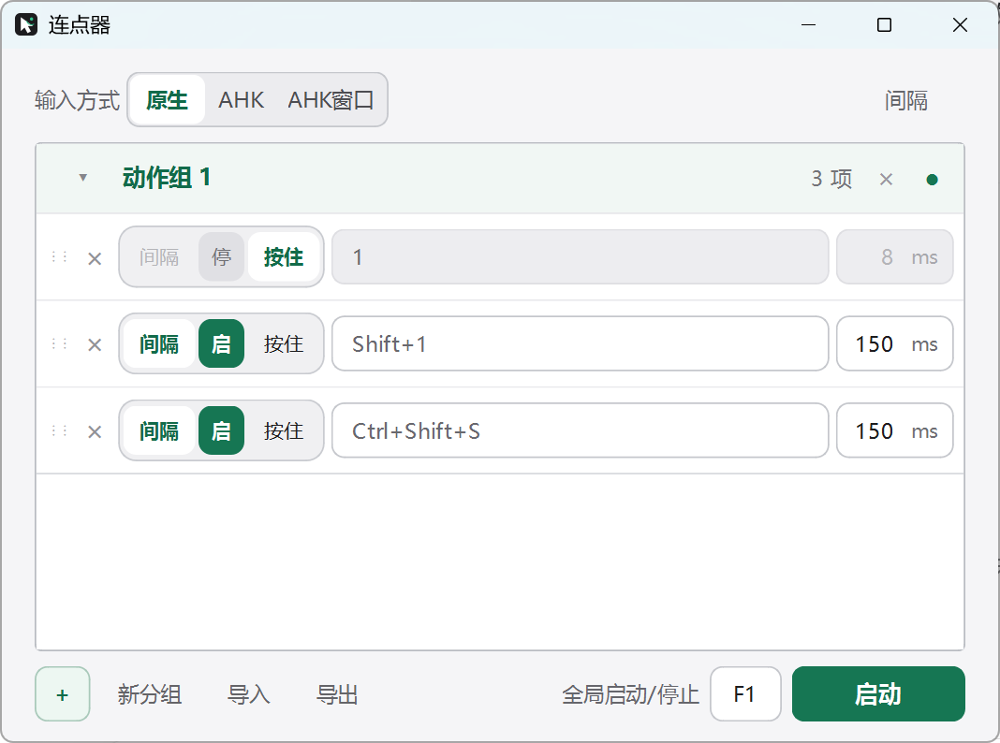
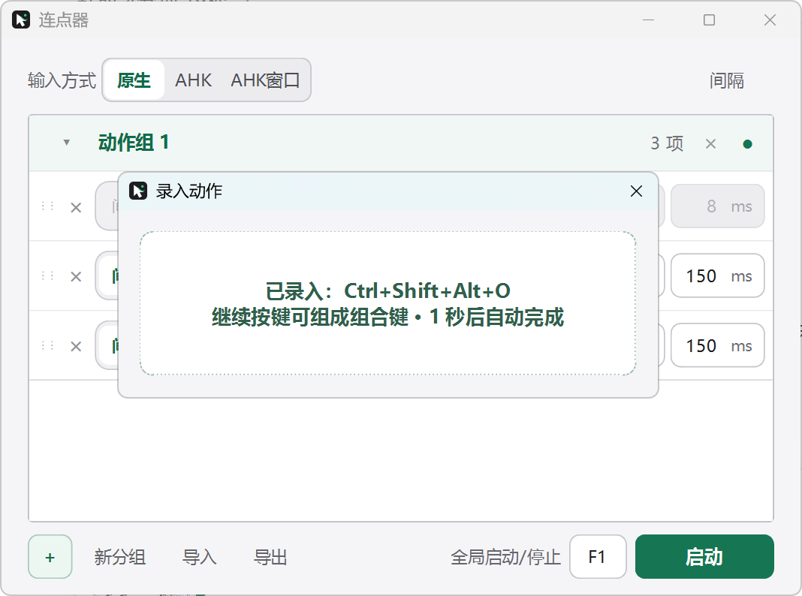

# 轻云连点器

> 轻盈如云，自由组合。

一个支持自定义录入的 Windows 10/11 开源连点器。点击录入按钮后，直接按下键盘键、鼠标按钮或组合键，最后一次输入 1 秒后自动完成录入。

[下载最新版 Windows EXE](https://github.com/v-49/qingyun-clicker/releases/latest)



## 主要功能

- 自定义录入键盘、鼠标左/右/中键和两个侧键。
- 支持 `Ctrl+Shift+A`、`A+B`、`Shift+鼠标左键` 等组合动作。
- 每个动作可选择“按间隔重复”或“持续按住”。
- 动作可单独启停；尚未设置的空白动作会自动跳过。
- 拖动左侧 `⋮⋮` 调整执行顺序，并自动保存。
- 多动作组、JSON 导入/导出、全局启动/停止快捷键。
- 内置 Windows 原生 `SendInput`；可选 AutoHotkey v2 和窗口定向模式。
- 停止、异常或退出时会释放仍处于按下状态的按键。

## 自定义录入

点击某一行的“未设置按键”，然后按下一个或多个键。每次新输入都会重新开始 1 秒倒计时，因此既能录入单键，也能自然录入多键组合。



## 快速使用

1. 从 [Releases](https://github.com/v-49/qingyun-clicker/releases) 下载 `轻云连点器.exe`。
2. 启动后确认 Windows UAC 提示。程序以管理员权限运行，便于向同样以管理员权限运行的目标程序发送输入。
3. 点击左下角 `＋` 添加动作。
4. 点击“未设置按键”，完成自定义录入。
5. 设置间隔或按住模式，然后点击“启动”；默认全局快捷键为 `F8`。

配置保存在当前 Windows 用户的应用设置中，不会上传到网络。

## 核心实现

- **录入模型**：把一次动作保存为有序输入单元列表，并单独记录 Ctrl、Shift、Alt、Win 修饰状态，兼容旧版单键配置。
- **组合键执行**：依次按下修饰键和动作键，停止或单次触发结束时按相反顺序释放，避免按键残留。
- **原生输入**：使用 Windows `SendInput`，键盘优先发送扫描码，鼠标使用对应按钮事件。
- **调度器**：独立线程基于单调时钟调度重复动作；停止事件可立即中断等待。
- **全局热键**：使用 `RegisterHotKey` 注册一个主键加可选修饰键。
- **AHK 后端**：可选调用 AutoHotkey v2；窗口模式使用 `ControlSend` / `ControlClick`。

## 兼容性边界

软件层输入不能保证在所有游戏中有效。目标程序可能读取 Raw Input、DirectInput，主动过滤合成事件，或由反作弊系统禁止自动化。请遵守目标软件和游戏规则；本项目不提供绕过反作弊或安全机制的能力。

## 从源码运行

```powershell
python -m venv .venv
.\.venv\Scripts\python.exe -m pip install -r requirements-dev.txt
.\.venv\Scripts\python.exe main.py
```

运行测试：

```powershell
.\.venv\Scripts\python.exe -m unittest -v test_product.py
```

打包 Windows EXE：

```powershell
.\build_shell.ps1
```

输出文件位于 `dist\轻云连点器.exe`，并内置 `requireAdministrator` 清单，因此每次启动都会显示 UAC 确认。

## 开源许可

[MIT License](LICENSE)
